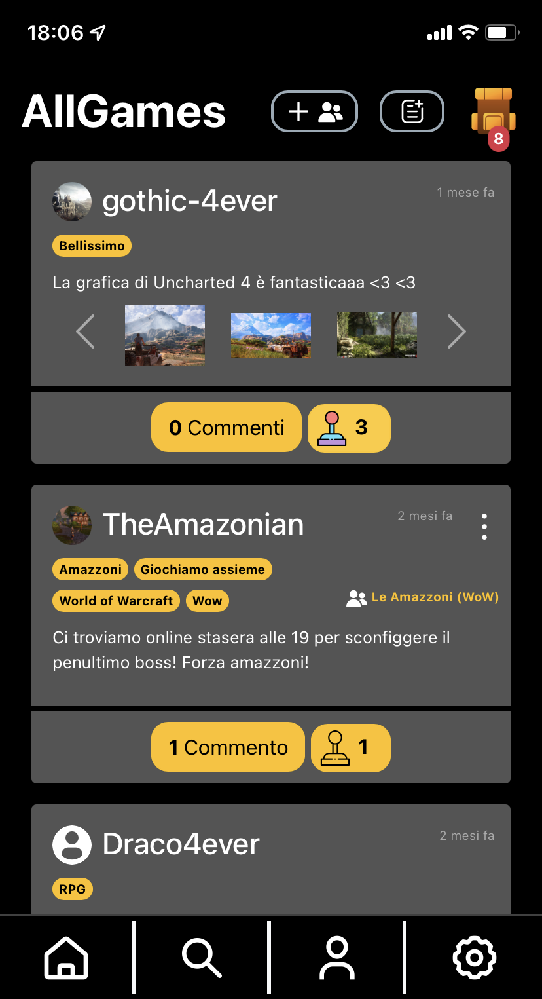

# AllGames
A social network about games!




## Installation

### Creating docker container for xampp
Be sure to have Docker installed.

Run this command. REMEMBER TO CHANGE THE \<variables\> AS YOU NEED:
```sh
docker run --name xampp -p <port-for-ssh-access>:22 -p 8080:80 -d -v <path-to-website-folder>:/www -v <path-to-db-sql-scripts-folder>:/allgames/db/scripts -v <path-to-sample-data-folder>:/allgames/sample-data tomsik68/xampp
```

Then run this to avoid problems from MariaDB:
```sh
docker exec xampp /opt/lampp/bin/mysql_upgrade
```

## Loading sample data (optional)
If you want to load the database with sample data run:
```sh
curl --location --request POST 'localhost:8080/www/db/scripts/loadSampleDB.php' \
--header 'Authorization: Basic YWRtaW46cGFzc3c='
```

## AllGames is now installed 🎉
You can now access AllGames at [http://localhost:8080/www/index.php](http://localhost:8080/www/index.php)

## Documentation

Here you can find all the documentation:
- [Specifiche di progetto](doc/specifiche_progetto.pdf)
- [Raccolta dei requisiti](doc/Requisiti.md)
- [Analisi dei requisiti](doc/Analisi.md)
- [Progettazione](doc/Progettazione.md)
