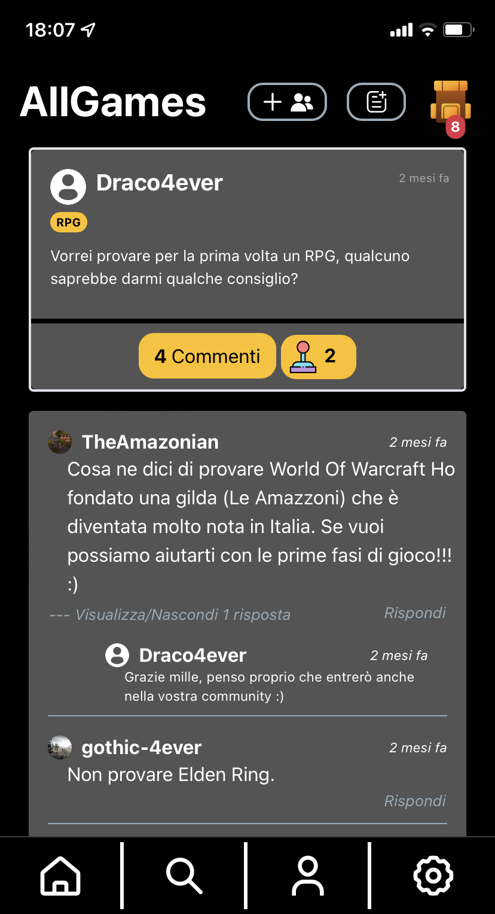
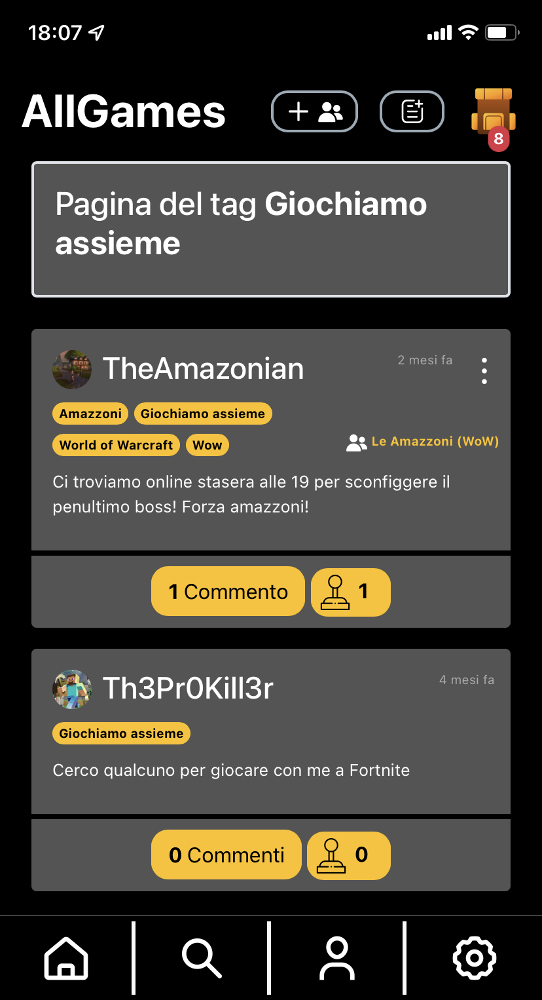

# **AllGames** 🕹️
A social network about games!

<div style="display: flex; justify-content: center">
    
    
    
</div>

## Installation 🔧

### Clone the repo
```console
git clone https://github.com/Ventus218/AllGames.git
```

Move inside the repo folder:
```sh
cd AllGames
```

### Creating docker container for xampp
Be sure to have Docker installed.

Create the container and mount necessary volumes:
```sh
docker run -d --name xampp \
-p 8080:80 \
-v $(pwd)/website:/www \
-v $(pwd)/db:/allgames/db/scripts \
-v $(pwd)/sample-data:/allgames/sample-data \
tomsik68/xampp
```

## Initializing the database 🐬
Resolve any eventual problems from MariaDB:
```sh
docker exec xampp /opt/lampp/bin/mysql_upgrade
```

Initialize the database:
```sh
curl --location --request POST 'localhost:8080/www/db/scripts/resetDB.php' \
--header 'Authorization: Basic YWRtaW46cGFzc3c='
```

## Loading sample data (optional) 💾
If you want to load the database with sample data:
```sh
curl --location --request POST 'localhost:8080/www/db/scripts/loadSampleDB.php' \
--header 'Authorization: Basic YWRtaW46cGFzc3c='
```

You can now log in as one of the sample users
|Username    |Password|
|------------|--------|
|YOU_DIED    |password|
|TheAmazonian|password|
|Th3Pr0Kill3r|password|
|gothic-4ever|password|
|roberuti    |password|
|draco4ever  |password|

## AllGames is now installed 🎉
You can now access AllGames at [http://localhost:8080/www/index.php](http://localhost:8080/www/index.php)

## Documentation 📖

Here you can find all the documentation:
- [Discussione elaborato](doc/Discussione-elaborato.md)
- [Specifiche di progetto](doc/specifiche_progetto.pdf)
- [Raccolta dei requisiti](doc/Requisiti.md)
- [Analisi dei requisiti](doc/Analisi.md)
- [Progettazione](doc/Progettazione.md)
